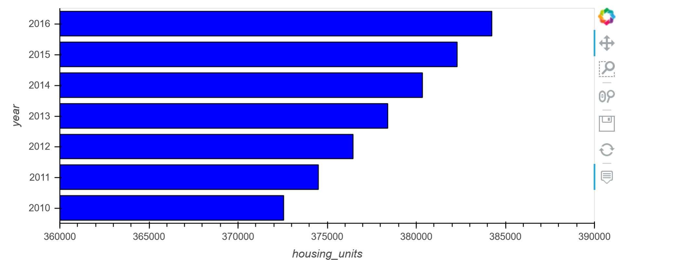
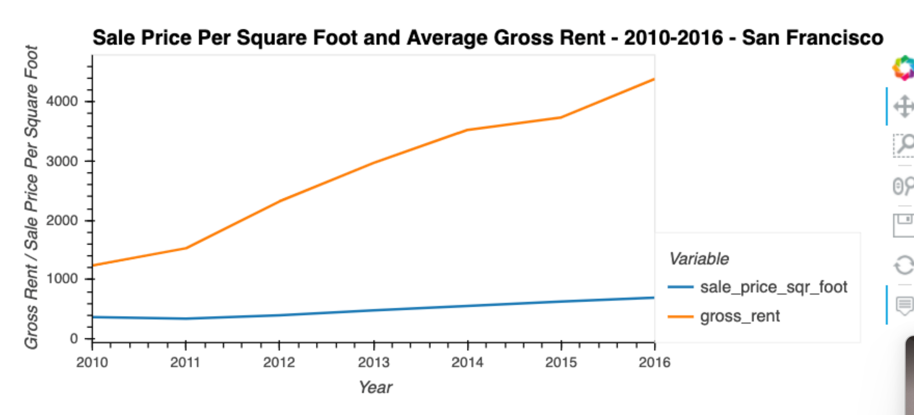
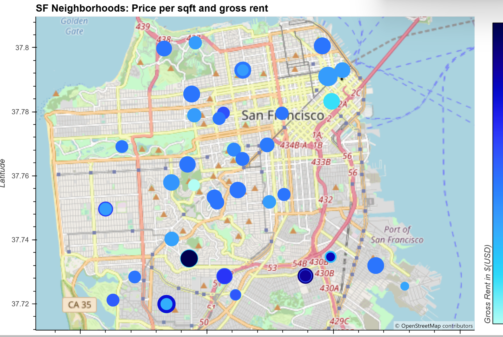

# Housing Market Analysis

## Purpose
This application analyzes real estate market data and includes visualizations. The data set sampled and analyzed is from San Francisco between the years 2010 and 2016. 

### Data and Files
The application analyzes data from 3 csv files.

    housing_per_year.csv
    neighborhoods_coordinates.csv
    sfo_neighborhoods_census_data.csv

---
## Technologies
### Python:

    Phyton Version: **3.7.13**

## Libraries

### hvplot
[hvplot](https://pypi.org/project/hvplot/)

### Pandas
[Pandas](https://pandas.pydata.org/pandas-docs/stable/reference/api/pandas.DataFrame.html) 

### Matplotlib
[Matplotlib](https://matplotlib.org/stable/api/_as_gen/matplotlib.pyplot.plot.html)

---
## How to run

1. Clone this repository 
2. Open the file with Jupiter Notebook

---
## Analysis
### Housing Price Data over time

### Avg Sale Price (per SqFt) and Gross Rent 

### Gross Rent in SF with GeoData efect

---
## Contributors
Startup code provided by UW FinTech Bootcamp

---
## License
Portfolio Risk Analysis tool is available under an MIT License.

---
## Aknowledgements
* [Markdown Guide](https://www.markdownguide.org/basic-syntax/#reference-style-links)

<!-- https://www.markdownguide.org/basic-syntax/#reference-style-links -->

